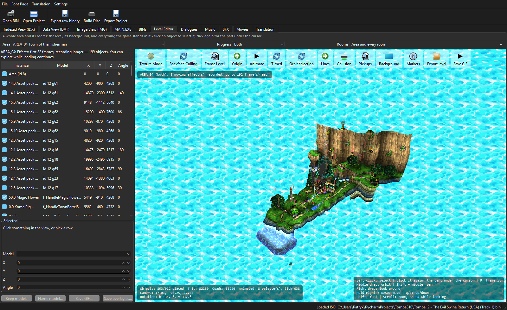
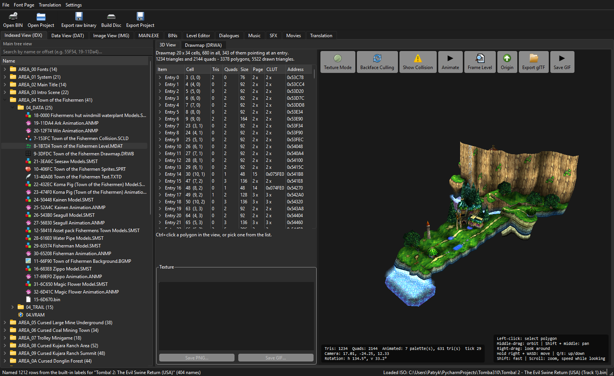
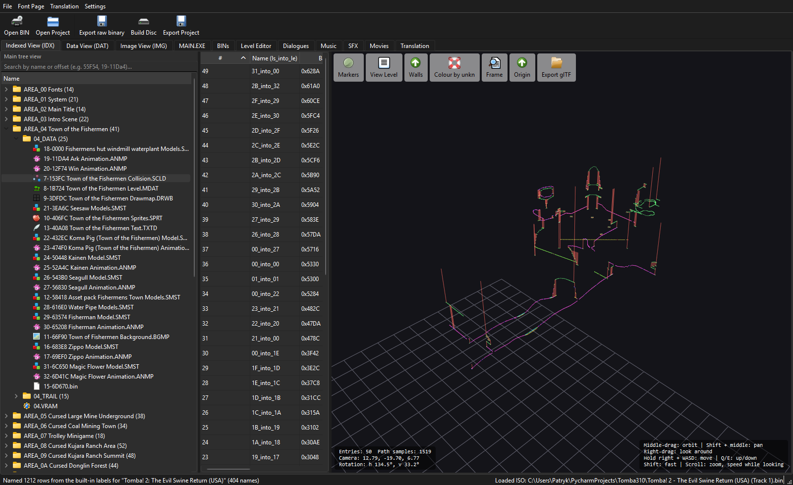
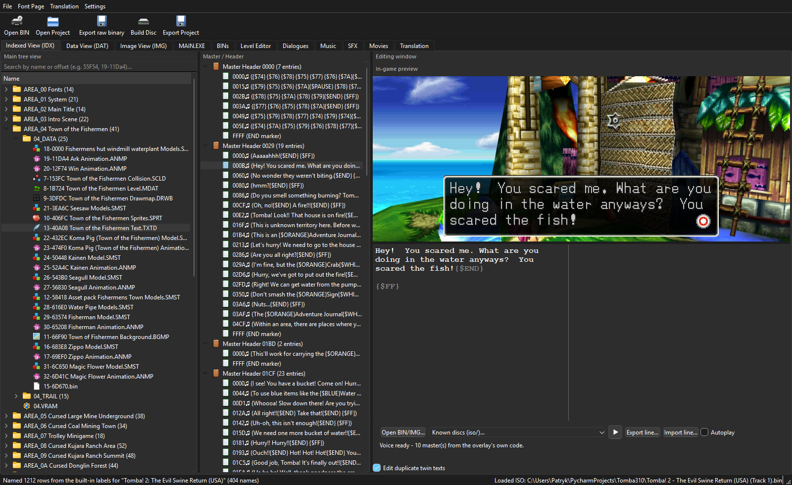
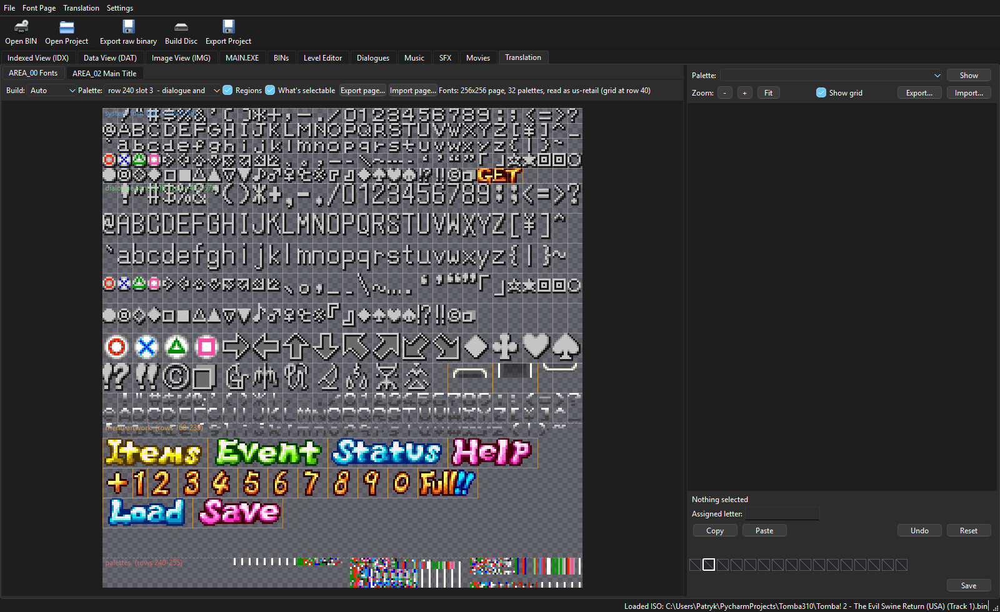
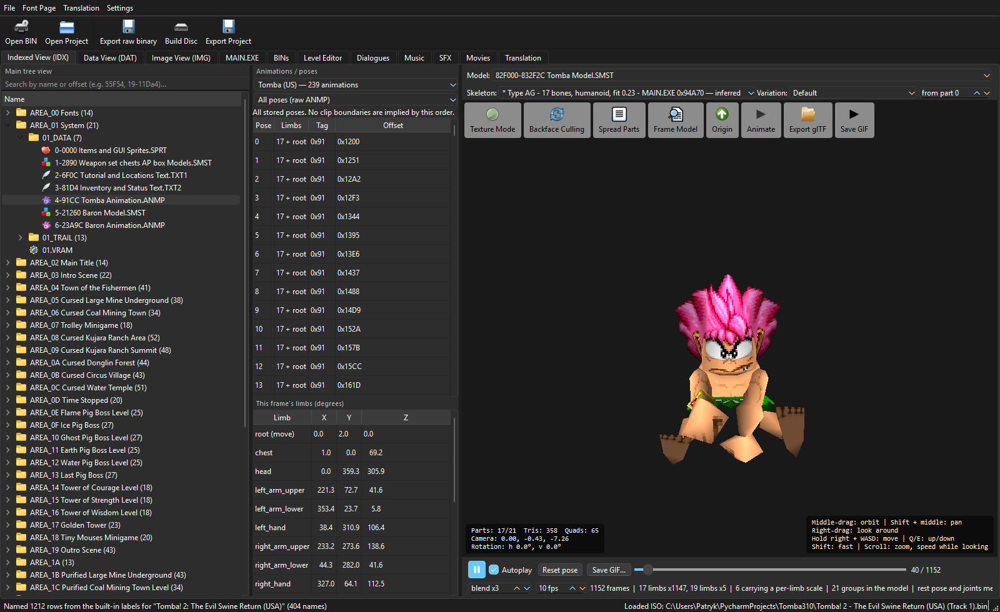
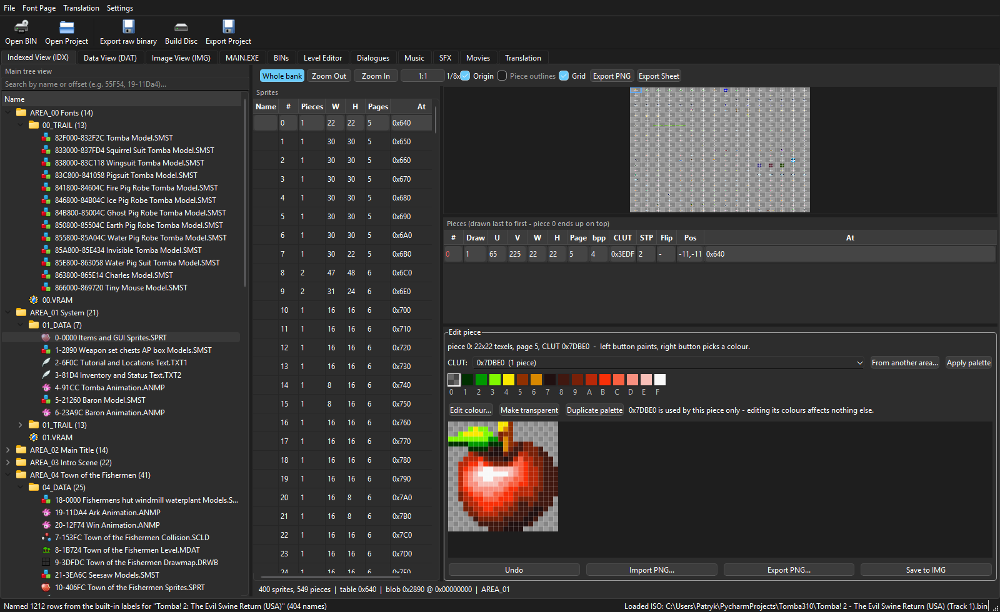
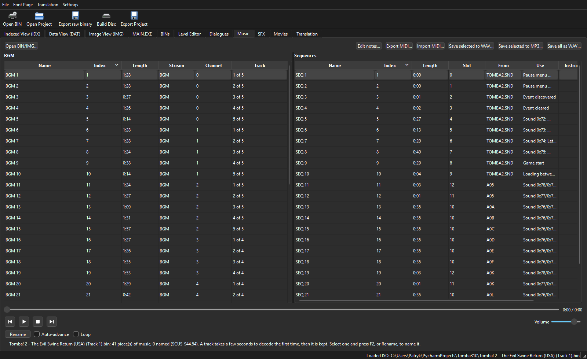
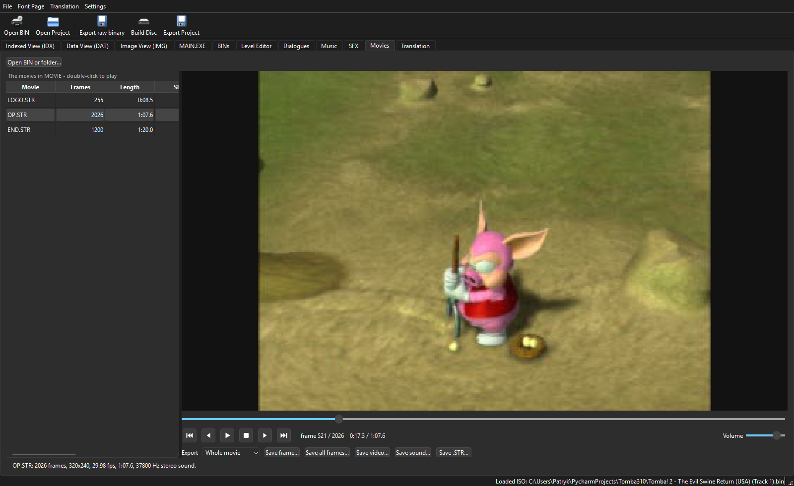

# Tomba2Edit

**A modding, translation and asset-extraction toolkit for _Tomba! 2: The Evil Swine Return_ (PlayStation).**

Tomba2Edit opens a disc image of the game and shows you what is inside it:
levels, collision, 3D models, animations, sprites, textures, dialogue,
music, sound effects and movies — each in a viewer that understands the
format, and most of them editable. Changes are staged, repacked and
written back out as a playable disc.

The project is built on reverse-engineering work by the
**[Tomba Club](https://tomba.club/wiki/Tomba!_2:_The_Evil_Swine_Return/Technical_information)**
community.

> **Goal:** make Tomba! 2's internal game data accessible to modders,
> translators, researchers and preservationists.

---

## What it looks like

### Level editor — a whole area, as the game builds it

The level editor runs the area's own code on a MIPS interpreter, so what
you see is what the game would place: the level, its background, every
object, every animation.



### Level geometry (MDAT), with its drawmap and textures



### Collision (SCLD)



### Text and translation, with the in-game dialogue box previewed live



### The font page — every character the game can draw, editable



### Models (SMST) and animation (ANMP), posed on a skeleton



### Sprites (SPRT), editable pixel by pixel



### Music and sequences



### Movies, decoded in software



---

## What it can do

### Game data and archives

* Read and analyse the game's `DAT` / `IDX` archives
* Extract, replace and repack files inside them
* Batch many edits into a single repack
* Handle sector alignment and pointer relocation when data changes size
* Name every file on the disc from a label set scored against the IDX

### Disc images

* Read PlayStation CD/ISO data and BIN/CUE rips
* Rebuild ISO9660 images with modified files
* Patch in place where it matters — the CD audio and XA music only
  survive that way

### Levels

* **MDAT** level geometry, textured, with per-polygon inspection
* **SCLD** collision planes, walls and paths
* **DRWA / DRWB** drawmaps
* **BGMP** background maps
* A level editor that assembles a whole area — objects, pickups, chests,
  rooms, effects — by running the game's own handlers

### 3D models and animation

* **SMST** model viewing, part by part
* **ANMP** animation playback on a reconstructed skeleton
* VRAM and texture-page visualisation
* **glTF / GLB export** with embedded textures and animation, ready for
  Blender
* Texture migration: move a model's art somewhere every area can reach it

### Graphics and sprites

* **SPRT** sprite banks, with a pixel editor and palette tools
* Sprite-sheet and PNG export
* PlayStation VRAM viewing and IMG chunk editing

### Text and translation

* **TXTD** / **TXT2** dialogue editing with a live in-game preview
* Font page editing — add characters the original disc never had
* Import/export whole scripts as JSON or plain text
* Japanese text support, including the console's own BIOS kanji font
* Voice clips linked to the lines they speak

### Audio

* Sequenced music (SEQ/VAB) with a note editor and MIDI import/export
* XA streamed music and voice
* Sound-effect banks
* WAV and optional MP3 export

### Movies

The three STR movies in the disc's `MOVIE` folder — `LOGO.STR`, `OP.STR`
and `END.STR`:

* Software MDEC decoding, so no external decoder is needed
* A frame-accurate timeline (every STR frame is independent, so seeking
  anywhere costs one frame)
* Export as a still PNG, a numbered PNG sequence, the soundtrack as
  WAV/MP3, the raw `.STR` sectors, or — where ffmpeg is on PATH — a
  finished MP4/MKV/AVI with the sound in it

The soundtrack lives in CD-XA Form 2 sectors, so it only survives in a
raw BIN/CUE data track; a 2048-byte ISO or an extracted `MOVIE` folder
gives the picture alone.

---

## Formats

Each format has a folder under `formats/`, holding its parser, its
renderer and its viewer together. The four-letter code stays in every
filename, so `scld_parser.py` is still what you search for — the folder
just says what SCLD *is*.

| Format          | What it is                        | Where it lives         |
| --------------- | --------------------------------- | ---------------------- |
| `DAT` / `IDX`   | Main archive and its index        | `formats/archive/`     |
| `MDAT`          | Level geometry                    | `formats/geometry/`    |
| `SCLD`          | Collision                         | `formats/collision/`   |
| `DRWA` / `DRWB` | Drawmaps                          | `formats/drawmaps/`    |
| `BGMP`          | Background maps                   | `formats/background/`  |
| `SMST`          | 3D models, and glTF export        | `formats/models/`      |
| `ANMP` / `TANP` | Animation and skeletons           | `formats/animation/`   |
| `SPRT`          | Sprite banks                      | `formats/sprites/`     |
| `IMG`           | Texture chunks                    | `formats/images/`      |
| `TXTD` / `TXT2` | Dialogue, font pages, translation | `formats/text/`        |
| `STR`           | MDEC movies with CD-XA sound      | `formats/movie/`       |
| `SEQ` / `VAB` / `XA` / `VAG` | Music, voice, sound   | `formats/audio/`       |
| `MAIN.EXE`, `*.BIN`, `SOP` | Executable and overlays | `formats/executable/` |

---

## Repository layout

```
main.py             the entry point
formats/            one package per game format — parser, renderer, viewer
psx/                the PlayStation itself: MIPS interpreter, GPU, VRAM
game/               what is true of Tomba! 2 in particular — placements,
                    handlers, labels, the eleven builds, actor simulation
disc/               ISO9660, BIN/CUE, raw sectors, rebuilding images
gui/                the application shell, its widgets and the level editor
  main_window/      the window, split into one mixin per concern
  widgets/          controls with no one format of their own
  level/            the level editor
icons/              artwork
labels/             file-name sets, per build
decomp/             symbols and per-build address maps
docs/               notes, format references, screenshots
examples/           standalone research tools and older experiments
```

The split between `psx/`, `game/` and `formats/` is the useful one: `psx/`
knows nothing about Tomba, `formats/` knows nothing about how the game
behaves, and `game/` is where the two meet — including `actor_sim`, which
answers "what is actually in this level?" by running the game's own code
rather than guessing.

---

## Installation

### Windows

Download the latest **Tomba2Edit executable** from the repository's
Releases page.

### From source

```bash
pip install PyQt6 numpy pillow PyOpenGL
python main.py
```

Optional: `lameenc` for MP3 export, and `ffmpeg` on PATH for finished
video files.

To build a standalone executable:

```bash
pyinstaller main.spec
```

---

## Getting started

1. Obtain a legally dumped copy of **Tomba! 2: The Evil Swine Return**.
2. A **BIN/CUE** dump of the US retail release is recommended — it is the
   only form that carries the CD audio and the voice track.
3. Open `Track 1.BIN` in Tomba2Edit.
4. Explore, edit, and export or repack your changes.

ISO images and extracted game directories also work, with the caveats
above.

> Tomba2Edit does **not** provide copyrighted Tomba! 2 game data. You
> must provide your own legally obtained dump.

---

## Controls

### Free camera (any 3D view)

Click inside a 3D viewport to enter free-camera mode.

| Input        | Action                        |
| ------------ | ----------------------------- |
| `W A S D`    | Move                          |
| `Q` / `E`    | Move up / down                |
| Middle-drag  | Orbit                         |
| Shift+middle | Pan                           |
| Right-drag   | Look around                   |
| Mouse wheel  | Zoom, or camera speed         |
| `Shift`      | Faster movement               |
| `F`          | Frame the selection           |

---

## Project status

Tomba2Edit is an active reverse-engineering and modding project. Some
formats and editing operations are mature; others are still being
researched.

Working today: archive repacking, text and font editing, level geometry,
collision and drawmap viewing, the level editor, model and animation
export, sprite editing, audio and movie export, ISO rebuilding and file
replacement.

---

## Contributing

Contributions are welcome — reverse engineering unknown formats,
improving parsers, testing modifications, adding exporters, documentation
and GUI work all help.

If you discover a bug or work out an undocumented Tomba! 2 format, please
open an Issue or start a discussion.

`examples/research/` holds standalone format-analysis tools, and
`docs/reference/` the hand-written format notes and disc maps the label
sets were built from.

---

## Credits

This project would not exist without the Tomba Club reverse-engineering
community. Thanks to everyone who contributed research, testing,
documentation and technical discoveries.

* **[Tomba Club Wiki](https://tomba.club/wiki/Tomba!_2:_The_Evil_Swine_Return/Technical_information)** — technical documentation
* **[Tomba Club Discord](https://discord.gg/7RPgnxrTt)** — discussion and collaboration

---

## Keywords

**Tomba! 2, Tomba 2, Tombi 2, Tomba 2: The Evil Swine Return, Tombi 2: The Evil Swine Return, Tomba 2 Evil Swine Return, Tombi 2 Evil Swine Return, Tomba 2 PlayStation, Tomba 2 PS1, Tomba 2 PSX, Tomba 2 game, Tomba 2 tools, Tomba 2 editor, Tomba 2 game editor, Tomba 2 modding, Tomba 2 modding tool, Tomba 2 modding tools, Tomba 2 ROM hack, Tomba 2 ROM hacking, Tomba 2 ROM hacking tools, Tomba 2 hack, Tomba 2 fan translation, Tomba 2 translation, Tomba 2 translation tool, Tomba 2 localization, Tomba 2 text editor, Tomba 2 text editing, Tomba 2 repacker, Tomba 2 exporter, Tomba 2 extractor, Tomba 2 asset extractor, Tomba 2 asset extraction, Tomba 2 data extraction, Tomba 2 DAT extractor, Tomba 2 DAT repacker, Tomba 2 IDX, Tomba 2 DAT IDX, Tomba 2 ISO editor, Tomba 2 ISO builder, Tomba 2 BIN CUE, Tomba 2 disc image, Tomba 2 game files, Tomba 2 file formats, Tomba 2 reverse engineering, Tomba 2 research, Tomba 2 game data, Tomba 2 game assets, Tomba 2 resources, Tomba 2 archive editor, Tomba 2 archive extractor, Tomba 2 level editor, Tomba 2 level viewer, Tomba 2 level modding, Tomba 2 collision editor, Tomba 2 collision viewer, Tomba 2 map editor, Tomba 2 map viewer, Tomba 2 3D editor, Tomba 2 3D viewer, Tomba 2 3D models, Tomba 2 model viewer, Tomba 2 model extractor, Tomba 2 model exporter, Tomba 2 character models, Tomba 2 animation, Tomba 2 animation viewer, Tomba 2 animation exporter, Tomba 2 skeleton, Tomba 2 textures, Tomba 2 texture viewer, Tomba 2 texture extractor, Tomba 2 sprites, Tomba 2 sprite editor, Tomba 2 sprite extractor, Tomba 2 spritesheet, Tomba 2 VRAM, Tomba 2 graphics, Tomba 2 background graphics, Tomba 2 audio extraction, Tomba 2 sound effects, Tomba 2 BGM, Tomba 2 music extraction, Tomba 2 WAV, Tomba 2 MP3, Tomba 2 glTF, Tomba 2 GLB, Tomba 2 Blender, Tomba 2 3D export, Tomba 2 asset viewer, PlayStation modding tools, PS1 modding tools, PSX modding tools, PlayStation ROM hacking, PS1 ROM hacking, PSX ROM hacking, PlayStation reverse engineering, PS1 reverse engineering, PSX reverse engineering, PlayStation game editor, PS1 game editor, PS1 asset extraction, retro game modding, classic game modding, game preservation, video game preservation, fan localization, fan translation tools, ROM hacking tools, game reverse engineering, game asset extraction, DAT file editor, DAT file extractor, DAT repacker, IDX file, ISO9660, glTF exporter, GLB exporter, Blender game assets, Python, PyQt6.**
